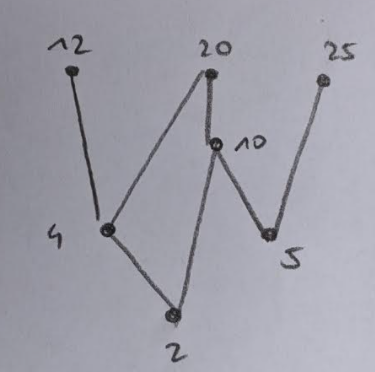

# P&T2 - Mathematics Part

Autor: Oliver Herzig (herzo1) 
Klasse: I2p 
Datum: 21.11.2020

## Aufgabe 1

### a)

$$ R = \{(a, b) : a,b \epsilon \Z, a \ne b\}$$
$$ A = \Z $$

- **Nicht** reflexiv, da $a \ne b$ widerspricht der reflexiven Bedingung (a,a) $\epsilon$ R
- **Symmetrisch**, da nur die Gerade $x=y$ (im Koordinatensystem betrachtet) nicht Teil von R ist, aber R sich über $x=y$ spiegeln lässt
- **transitiv**, da wenn $a \ne b$ und $b \ne c$ dann muss auch $a \ne c$ geben, da a und c nicht die gleiche Zahl sein dürfen, da c sonst nicht zur Relation R gehören würde.

### b)

$$ R = \{(a, b) : a,b \epsilon \R, a + b = 1\}$$
$$ A = \R $$

- **Nicht** reflexiv, da $1+1\ne 1$
- **Symmetrisch**, da sich die Funktion $a+b=1$ an $a=b$ spiegelt.
- **Nicht** transitiv, da $(1,0) \epsilon R$, $(0,1) \epsilon R$ aber $(1,1)$ ist nicht $\epsilon R$.

### c)

$$ R = \{(a, b) : a,b \epsilon \R, a^2 < b^2\}$$
$$ A = \R $$

- **Nicht** reflexiv, da $1^2 \nless 1^2$
- **Nicht** symmetrisch, da $1^2 < 2^2$ aber nicht $2^2 < 1^2$
- **Transitiv**, da wenn $a^2 < b^2$ und $b^2 < c^2$ dann muss gelten, dass $a^2 < c^2$

### d)

$$ R = \{(2,1), (3,2), (3,1)\} $$
$$ A = \{1,2,3\}$$

- **Nicht** reflexiv, da $(1,1)$ nicht in R
- **Nicht** symmetrisch, da zwar $(1,2)$, aber nicht $(2,1)$ in R
- **transitiv**, da $(1,2)$, $(2,3)$ und auch $(1,3)$ in R

## Aufgabe 2

### a (linke Figur))

$$ R = \{x^2 + y^2 \leqslant 1 \land x + y \geqslant 1\}$$

### b (mittlere Figur))

$$ R = \{x^2 + y^2 \leqslant 1\}$$

### c (rechte Figur))

$$ R = \{x + y \geqslant 1\}$$

## Aufgabe 3

### a)

### b)

minimal: $\{2, 5\}$  
maximal: $\{12, 20, 25\}$

### c)

total order: $\{2,4, 5, 10, 12, 20, 25\}$

## Aufgabe 4

$$ xRy \iff x - y \ is \  even $$

### Reflexiv

$$ x-x = 0 \Rightarrow is \ even \Rightarrow reflexiv $$

### Symmetrisch

$$ xRy \Rightarrow x-y \ is \ even \Rightarrow y-x = -(x-y) \ is \ even \Rightarrow symmetrisch $$

### Transitiv

$$ xRy, yRz \Rightarrow x-y, y-z \ are \ even \Rightarrow x-z = (x-y) + (y - z) \ is \ even \Rightarrow transitiv$$

Äquivalenzklassen:

Es gibt zwei Äquivalenzklassen: Alle Kombination aus geraden Zahlen ($K_{even} x K_{even}$)und alle Kombinationen aus ungeraden Zahlen ($K_{odd} x K_{odd}$).

$$ A_{even} = \{(0,0), (0,2), (0,4),..., (2,0), (2,2),...\} $$ 
$$ A_{odd} = \{(1,1), (1,3), (1,5),..., (3,1), (3,3),...\} $$ 

## Aufgabe 5

### e)

RSA is not widely used in the industry anymore. Write a brief paragraph (< 300 words)
describing where RSA is still used, why it is not used as widely as before, what are some of
the popular encryption methods today and what their advantages over RSA are.

Der grösste Nachteil von RSA ist, dass das Verschlüsseln von grossen Datenmengen (z.B. über Streams) langsam ist. Und da in der heutigen Zeit die Datenströme immer grösser werden und trotzdem verschlüsselt und schnell sein sollten (z.B. HTTPS Kommunikation), wird RSA als asymmetrisches Kryptosystem zusammen mit symmetrischen Kryptosystemen (ein Schlüssel für beide Parteien; z.B. AES) eingesetzt. Dabei wir das RSA verfahren verwendet, um den gemeinsamen Schlüssel auszutauschen und wenn das Geschehen ist, erfolgt die ganze Kommunikation nur noch über den einen gemeinsamen Schlüssel.

Der Vorteil von symmetrischen Kryptosystemen ist eine viel schnellere Ver- und Entschlüsselung, als über RSA und es besitzt nicht den Schwachpunkt mit Faktorisieren bei schlecht gewählten Primzahlen. Auch müssen dafür keine grossen Primzahlen gefunden werden, da es meist auf einem zufälligen Schlüssel basiert. Mit Perfect Forward Secrecy (PFS) bleibt die Kommunikation auch dann noch *geheim*, wenn der Schlüssel irgendwann publik werden sollte.

Andere asymmetrische Kryptosysteme sind:

- Digital Signature Algorithm (DSA)
- Elliptic Curve DSA (ECDSA)
- Ed25519
